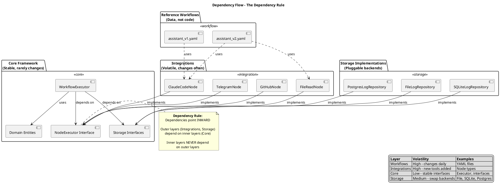
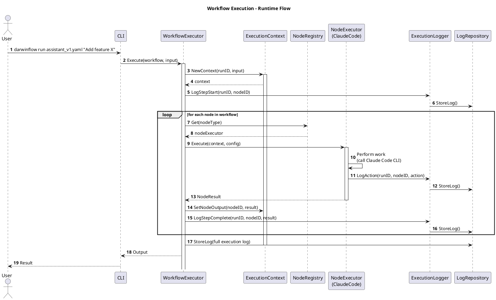
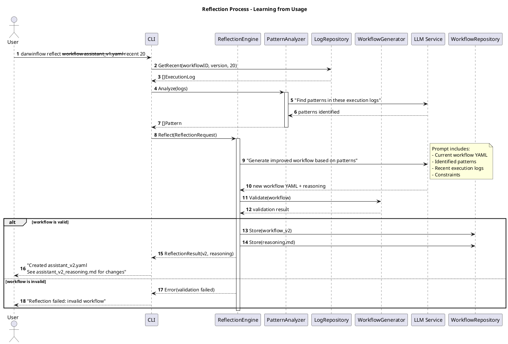
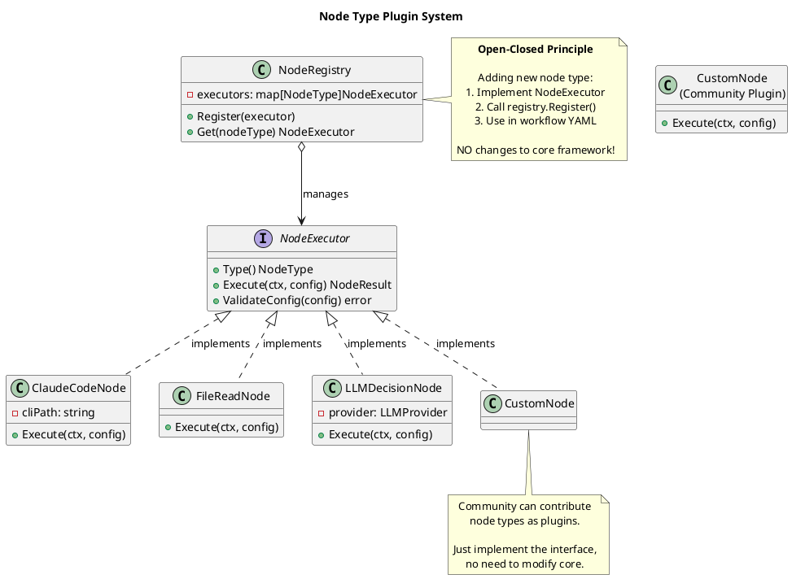
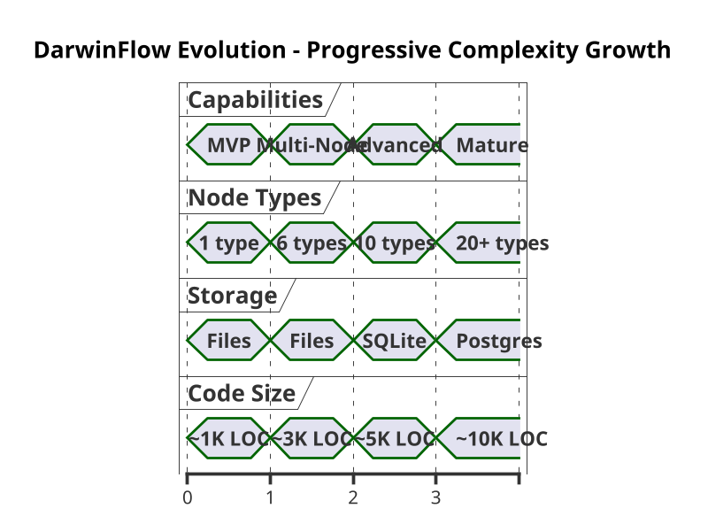
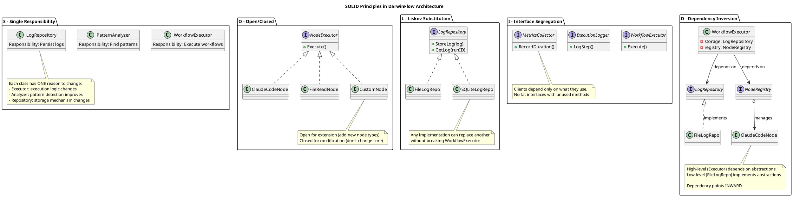
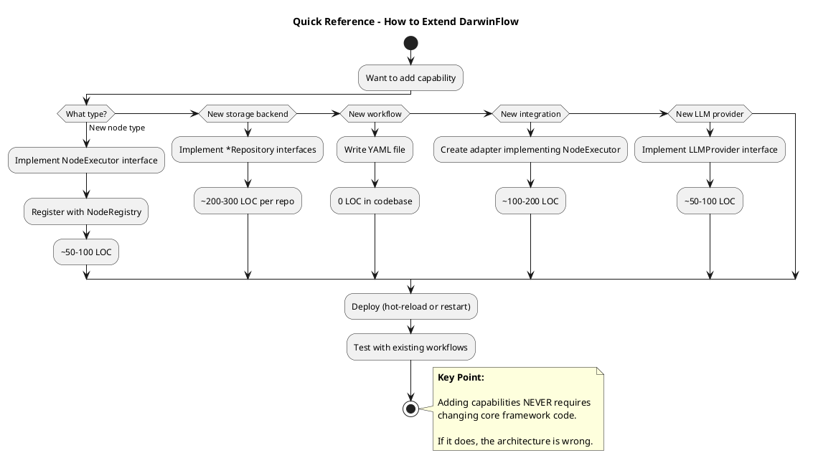

# Architecture Diagrams

**Author**: Bob Martin
**Date**: 2025-10-09
**Status**: Target Architecture - Visual Reference
**Version**: 1.0

---

## Purpose

Visual representations of DarwinFlow's architecture using C4 model and PlantUML.

---

## C4 Level 1: System Context

Shows DarwinFlow in its environment - who uses it and what it integrates with.

```plantuml
@startuml DarwinFlow System Context
!include https://raw.githubusercontent.com/plantuml-stdlib/C4-PlantUML/master/C4_Context.puml

LAYOUT_WITH_LEGEND()

title System Context - DarwinFlow Learning Workflow Framework

Person(user, "User", "Software Engineer, PM, or Architect using AI for repetitive tasks")
Person(admin, "Admin", "System administrator configuring workflows and integrations")

System(darwinflow, "DarwinFlow", "Learning workflow framework that improves through use")

System_Ext(claude_code, "Claude Code", "AI coding assistant CLI")
System_Ext(telegram, "Telegram", "Messaging platform for task input")
System_Ext(github, "GitHub", "Code repository and project management")
System_Ext(llm_api, "LLM APIs", "Claude, GPT, Local LLMs")
System_Ext(filesystem, "File System", "Local files and project code")

Rel(user, darwinflow, "Executes workflows", "CLI/API")
Rel(admin, darwinflow, "Configures", "YAML files")

Rel(darwinflow, claude_code, "Delegates tasks to", "CLI")
Rel(darwinflow, telegram, "Sends/receives messages", "Bot API")
Rel(darwinflow, github, "Manages issues, PRs", "REST API")
Rel(darwinflow, llm_api, "Makes decisions", "REST API")
Rel(darwinflow, filesystem, "Reads/writes files", "OS API")

@enduml
```

**Key insight**: DarwinFlow orchestrates external tools, it doesn't replace them.

---

## C4 Level 2: Container Diagram

Shows the major containers (applications/services) within DarwinFlow.

```plantuml
@startuml DarwinFlow Containers
!include https://raw.githubusercontent.com/plantuml-stdlib/C4-PlantUML/master/C4_Container.puml

LAYOUT_WITH_LEGEND()

title Container Diagram - DarwinFlow Architecture

Person(user, "User", "Executes workflows")

System_Boundary(darwinflow, "DarwinFlow") {
    Container(cli, "CLI", "Go", "Command-line interface for workflow execution")
    Container(core, "Core Framework", "Go", "Workflow execution engine, state management")
    Container(integrations, "Integrations", "Go", "Adapters for external tools (plugins)")
    Container(reflection, "Reflection Engine", "Go + LLM", "Analyzes logs and generates new workflows")
    Container(storage, "Storage Layer", "Go", "Abstract persistence (files, SQLite, Postgres)")
}

System_Ext(llm, "LLM Service", "Claude/GPT")
System_Ext(tools, "External Tools", "Claude Code, Telegram, GitHub, etc.")
ContainerDb(workflows, "Workflows", "YAML Files", "Workflow definitions (versioned)")
ContainerDb(logs, "Execution Logs", "JSON/SQLite", "Detailed execution history")
ContainerDb(metrics, "Metrics", "JSON/SQLite", "Aggregated metrics and patterns")

Rel(user, cli, "Runs workflows", "darwinflow run")
Rel(cli, core, "Executes", "Function calls")
Rel(core, integrations, "Delegates to nodes", "NodeExecutor interface")
Rel(core, storage, "Persists data", "Repository interfaces")

Rel(integrations, tools, "Calls", "Various protocols")
Rel(reflection, llm, "Analyzes patterns", "LLM API")
Rel(reflection, storage, "Reads logs", "Repository interfaces")
Rel(reflection, workflows, "Generates new versions", "YAML files")

Rel(storage, workflows, "Reads/writes", "File I/O")
Rel(storage, logs, "Reads/writes", "File I/O / SQL")
Rel(storage, metrics, "Reads/writes", "File I/O / SQL")

@enduml
```

**Key insight**: Core framework depends on abstractions, not concrete implementations.

---

## C4 Level 3: Component Diagram (Core Framework)

Shows internal components of the Core Framework.

```plantuml
@startuml Core Framework Components
!include https://raw.githubusercontent.com/plantuml-stdlib/C4-PlantUML/master/C4_Component.puml

LAYOUT_WITH_LEGEND()

title Component Diagram - Core Framework

Container(cli, "CLI", "Command-line interface")

Container_Boundary(core, "Core Framework") {
    Component(executor, "WorkflowExecutor", "Go", "Executes workflows, manages state")
    Component(loader, "WorkflowLoader", "Go", "Loads and validates workflows")
    Component(registry, "NodeRegistry", "Go", "Manages node type executors (plugin system)")
    Component(logger, "ExecutionLogger", "Go", "Records execution events")
    Component(metrics, "MetricsCollector", "Go", "Collects runtime metrics")
    Component(context, "ExecutionContext", "Go", "Provides runtime state to nodes")
}

Container_Boundary(interfaces, "Core Interfaces") {
    Component(iworkflow, "WorkflowRepository", "Interface", "Store/retrieve workflows")
    Component(ilog, "LogRepository", "Interface", "Store/retrieve logs")
    Component(imetrics, "MetricsRepository", "Interface", "Store/retrieve metrics")
    Component(inode, "NodeExecutor", "Interface", "Execute node types")
}

Container(integrations, "Integrations", "Node implementations")
Container(storage, "Storage", "Repository implementations")

Rel(cli, loader, "Loads workflow", "LoadFromFile()")
Rel(cli, executor, "Executes", "Execute()")

Rel(executor, registry, "Gets node executor", "Get(nodeType)")
Rel(executor, context, "Creates", "NewContext()")
Rel(executor, logger, "Logs events", "LogStep()")
Rel(executor, metrics, "Records metrics", "RecordDuration()")

Rel(loader, iworkflow, "Uses", "Get()")
Rel(logger, ilog, "Uses", "StoreLog()")
Rel(metrics, imetrics, "Uses", "RecordExecution()")

Rel(registry, inode, "Manages", "Register()")
Rel(context, inode, "Provides to", "Execute()")

Rel(inode, integrations, "Implemented by", "")
Rel_Back(iworkflow, storage, "Implemented by", "")
Rel_Back(ilog, storage, "Implemented by", "")
Rel_Back(imetrics, storage, "Implemented by", "")

@enduml
```

**Key insight**: Interfaces define boundaries. Implementations can vary without affecting core.

---

## Dependency Flow Diagram

Shows direction of dependencies (critical for clean architecture).



**Key insight**: Arrows point inward. Core never imports from integrations or storage.

---

## Workflow Execution Sequence

Shows the runtime flow when executing a workflow.



**Key insight**: Context provides state. Logger records everything. Registry enables plugins.

---

## Reflection Process Flow

Shows how reflection generates new workflow versions.



**Key insight**: Reflection is LLM-powered. It reads logs, finds patterns, generates new versions.

---

## Storage Architecture

Shows storage abstraction and implementations.

```plantuml
@startuml Storage Architecture
skinparam defaultTextAlignment center

title Storage Architecture - Abstract Persistence

package "Core Framework" {
    interface "WorkflowRepository" as IWorkflow {
        +Store(workflow)
        +Get(id, version)
        +GetLatest(id)
        +List(id)
    }

    interface "LogRepository" as ILog {
        +StoreLog(log)
        +GetLog(runID)
        +QueryLogs(filter)
    }

    interface "MetricsRepository" as IMetrics {
        +RecordExecution(metric)
        +GetSummary(id, version)
        +GetPatterns(id)
    }
}

package "Storage Implementations" {
    class "FileWorkflowRepo" {
        -baseDir: string
        +Store(workflow)
        +Get(id, version)
    }

    class "FileLogRepo" {
        -baseDir: string
        +StoreLog(log)
        +GetLog(runID)
    }

    class "SQLiteLogRepo" {
        -db: *sql.DB
        +StoreLog(log)
        +GetLog(runID)
    }

    class "PostgresLogRepo" {
        -db: *sql.DB
        +StoreLog(log)
        +GetLog(runID)
    }
}

package "Storage Media" {
    database "YAML Files" as files
    database "JSON Files" as json
    database "SQLite DB" as sqlite
    database "Postgres DB" as postgres
}

IWorkflow <|.. FileWorkflowRepo : implements
ILog <|.. FileLogRepo : implements
ILog <|.. SQLiteLogRepo : implements
ILog <|.. PostgresLogRepo : implements
IMetrics <|.. FileLogRepo : implements (metrics in files)
IMetrics <|.. SQLiteLogRepo : implements (metrics in DB)

FileWorkflowRepo --> files
FileLogRepo --> json
SQLiteLogRepo --> sqlite
PostgresLogRepo --> postgres

note right of IWorkflow
    **Liskov Substitution Principle**

    Any implementation can replace another
    without breaking core framework.

    Core depends on INTERFACE,
    not concrete implementation.
end note

legend right
    |= Phase |= Workflow |= Logs |= Metrics |
    | MVP (1) | Files | Files | Files |
    | Growth (2) | Files | SQLite | SQLite |
    | Scale (3) | Files | Postgres | Postgres |

    Mix and match as needed!
endlegend

@enduml
```

**Key insight**: Storage backend is swappable. Core never knows what's used.

---

## Node Type Plugin System

Shows how node types register and execute.



**Key insight**: Plugin system via interface. Add node types without touching core.

---

## Evolution Timeline

Visual representation of how the system grows.



```plantuml
@startuml Evolution Features
left to right direction
skinparam activityBackgroundColor<<phase1>> LightBlue
skinparam activityBackgroundColor<<phase2>> LightGreen
skinparam activityBackgroundColor<<phase3>> LightYellow
skinparam activityBackgroundColor<<phase4>> LightCoral

title Feature Evolution by Phase

rectangle "**Phase 1: MVP**\n(Weeks 1-4)" <<phase1>> {
    (*) --> "1 Node Type\n(CLAUDE_CODE)"
    --> "File Storage"
    --> "Manual Reflection"
    --> "Basic Logging"
}

rectangle "**Phase 2: Multi-Node**\n(Months 2-3)" <<phase2>> {
    "6 Node Types" --> "Conditional Edges"
    --> "Better Metrics"
    --> "Pattern Detection"
}

rectangle "**Phase 3: Advanced**\n(Months 4-6)" <<phase3>> {
    "10 Node Types" --> "Parallel Execution"
    --> "Sub-workflows"
    --> "SQLite Storage"
    --> "Retry Logic"
}

rectangle "**Phase 4: Mature**\n(Months 7-12)" <<phase4>> {
    "20+ Node Types" --> "Multiple LLM Providers"
    --> "Community Plugins"
    --> "Real-time Learning"
    --> "Workflow Marketplace"
}

@enduml
```

**Key insight**: Grow incrementally. Each phase adds capabilities without breaking previous ones.

---

## Integration Patterns

Shows common integration patterns.

```plantuml
@startuml Integration Patterns
title Integration Patterns

package "Pattern 1: External Tool Adapter" {
    class "ClaudeCodeNode" {
        -cliPath: string
        +Execute(ctx, config)
    }

    component "Claude Code CLI" as cli

    ClaudeCodeNode --> cli : wraps
}

package "Pattern 2: Primitive Operation" {
    class "FileReadNode" {
        +Execute(ctx, config)
    }

    component "File System" as fs

    FileReadNode --> fs : direct access
}

package "Pattern 3: LLM-Powered" {
    class "LLMDecisionNode" {
        -provider: LLMProvider
        +Execute(ctx, config)
    }

    interface "LLMProvider" {
        +Complete(prompt) response
    }

    class "AnthropicProvider"
    class "OpenAIProvider"

    LLMDecisionNode --> LLMProvider
    LLMProvider <|.. AnthropicProvider
    LLMProvider <|.. OpenAIProvider
}

package "Pattern 4: Composite" {
    class "SubWorkflowNode" {
        -executor: WorkflowExecutor
        +Execute(ctx, config)
    }

    component "Nested Workflow" as nested

    SubWorkflowNode --> nested : delegates to
}

note bottom
    **Integration Guidelines:**

    1. Keep adapters thin (wrap, don't implement logic)
    2. Log all external calls
    3. Handle errors gracefully
    4. Use timeouts
    5. Make them reusable
end note

@enduml
```

**Key insight**: Different integration patterns for different needs. All implement same interface.

---

## SOLID Principles Applied

Visual representation of how SOLID principles manifest in the architecture.



**Key insight**: SOLID isn't academic theory. It's how this architecture enables evolution.

---

## Quick Reference: Adding Capabilities



---

## Summary

These diagrams show:

1. **System Context** - DarwinFlow in its environment
2. **Containers** - Major components and their relationships
3. **Components** - Internal structure of core framework
4. **Dependencies** - Direction of dependencies (inward!)
5. **Sequences** - Runtime execution flow
6. **Storage** - Abstraction and implementations
7. **Plugins** - Node type registration system
8. **Evolution** - How system grows over time
9. **Patterns** - Common integration patterns
10. **SOLID** - Principles in practice

**Use these diagrams to**:
- Understand high-level architecture
- Explain system to new developers
- Make design decisions
- Verify dependency direction
- Plan extensions

**Remember**: Architecture is about managing dependencies and handling change. If you can't explain it with a diagram, you don't understand it.

---

**Architecture documentation complete**:
- [00_architecture_overview.md](00_architecture_overview.md)
- [01_core_interfaces.md](01_core_interfaces.md)
- [02_integration_architecture.md](02_integration_architecture.md)
- [03_storage_architecture.md](03_storage_architecture.md)
- [04_evolution_roadmap.md](04_evolution_roadmap.md)
- [05_architecture_diagrams.md](05_architecture_diagrams.md) (this document)

**Now go build it.**
